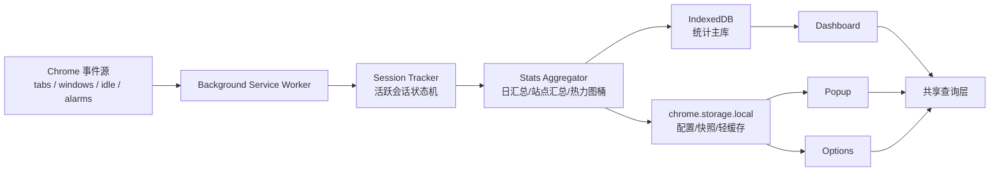

# 浏览行为分析器技术方案

- 文档版本：V1.0
- 编写日期：2026-07-18
- 对应 PRD：Chrome 插件《浏览行为分析器》PRD V1.0
- 目标平台：Chrome / Edge / Brave（Chromium 内核）

## 1. 方案目标

本文档用于把 PRD 落到可实施的工程方案，重点回答以下问题：

1. Chrome Manifest V3 下如何稳定追踪“活跃浏览时长”。
2. 如何在“隐私优先”和“权限最小化”前提下实现排行榜、历史分析、热力图和导出。
3. 如何控制本地存储体积、降低后台资源占用，并兼顾 Popup 打开速度。

## 2. 关键技术结论

### 2.1 总体结论

- 扩展采用 `Manifest V3 + background service worker` 架构。
- UI 采用 `React + TypeScript + Vite`，分别构建 `Popup`、`Dashboard`、`Options` 三个页面。
- 历史统计数据主存储采用 `IndexedDB`，`chrome.storage.local` 只保存配置、快照和轻量缓存。
- 核心统计不以 `chrome.history` 为主数据源，而以实时事件追踪为主，避免把“访问历史”误当作“活跃停留时长”。
- 数据策略采用“只在本地生成、只在本地存储、只在本地导出”，不引入任何服务端、同步通道或第三方分析 SDK。
- 权限采用“默认最小化 + 本地优先”的策略，MVP 不申请 `<all_urls>`，也不引入 `chrome.storage.sync`。

### 2.2 对 PRD 技术描述的修正

PRD 中提到可通过 `chrome.history.search` 和 `chrome.history.getVisits` 统计访问情况。该方式适合做“浏览历史检索”，但不适合做“活跃浏览时长”主统计，原因如下：

- `history` 无法判断标签页是否处于前台。
- `history` 无法判断浏览器窗口是否失焦。
- `history` 无法判断用户是否已空闲。
- `history` 作为常驻核心权限，会增加安装时的敏感提示，不利于隐私定位。

因此本方案建议：

- `实时时长`、`活跃度`、`热力图`、`排行榜` 由实时事件追踪生成。
- `history` 仅作为未来可选能力，用于“安装后历史回填”或“数据修复导入”，不进入 MVP 基线。

### 2.3 本地存储红线

以下约束作为工程红线，不作为可选项：

1. 所有统计数据仅允许写入 `IndexedDB` 和 `chrome.storage.local`。
2. 不接入 `chrome.storage.sync`，不做跨设备同步。
3. 不接入任何远程 API、遥测、埋点、错误上报、特征上报。
4. 不依赖 CDN、远程字体、远程脚本、远程图片。
5. 导出仅生成用户本地文件，不存在服务端中转。
6. 不保存完整 URL、页面标题、查询参数、表单内容等高敏感信息。

## 3. 技术选型

### 3.1 前端与工程化

| 层级 | 选型 | 说明 |
|------|------|------|
| 扩展规范 | Manifest V3 | 满足 Chrome 当前扩展规范 |
| 页面框架 | React + TypeScript | Dashboard 图表较多，组件化收益明显 |
| 构建工具 | Vite | 多入口构建快，适合 Popup / Dashboard / Options |
| 图表库 | Apache ECharts（按需引入） | 同时覆盖折线图、柱状图、环图、热力图 |
| 样式 | CSS Modules + CSS Variables | 体积可控，适合主题切换 |
| 测试 | Vitest + Playwright | 分别覆盖单测和扩展端到端测试 |
| 质量工具 | ESLint + Prettier | 保证代码一致性 |

### 3.2 为什么不选择原生 JS

若只实现一个极简 Popup，原生 JS 足够；但本产品存在以下特征：

- 多页面入口
- 多图表渲染
- 复杂时间筛选和排序
- 设置页规则编辑
- 后续还会加入导出、限额提醒、多语言

在这种复杂度下，React + TypeScript 的长期维护成本更低。

## 4. 系统架构



### 4.1 运行角色

- `background service worker`
  - 监听浏览器事件
  - 维护当前活跃会话
  - 做时间切片、聚合、落库
  - 处理暂停追踪、清理数据、限额判断
- `popup`
  - 展示今日摘要、当前站点、TOP5
  - 只读取轻量缓存，不做重查询
- `dashboard`
  - 展示完整统计分析
  - 直接读取 IndexedDB，并复用共享查询逻辑
- `options`
  - 管理分类规则、保留策略、时间限额、主题和语言

### 4.2 模块划分

| 模块 | 职责 |
|------|------|
| `tracking/session-tracker` | 活跃上下文识别、会话开始/结束 |
| `tracking/domain-normalizer` | URL 过滤、域名归一化 |
| `stats/aggregator` | 时长、访问次数、小时桶、15 分钟桶聚合 |
| `stats/query-service` | 今日摘要、趋势、排行、热力图查询 |
| `category/category-engine` | 站点分类规则匹配 |
| `limits/limit-engine` | 限额判断与提醒 |
| `storage/idb-repository` | 历史统计持久化 |
| `storage/local-cache` | 快照、配置、轻量缓存 |
| `export/export-service` | CSV / JSON 导出 |

## 5. 权限设计

### 5.1 MVP 基础权限

```json
{
  "permissions": [
    "tabs",
    "storage",
    "alarms",
    "idle"
  ]
}
```

说明：

- `tabs`：读取当前活动标签信息，监听激活、关闭、更新事件。
- `storage`：保存配置和缓存。
- `alarms`：定时刷新快照、清理过期数据。
- `idle`：识别用户系统空闲状态，避免把离开电脑的时间算进活跃时长。

### 5.2 非 MVP 或按需权限

| 权限 | 用途 | 建议 |
|------|------|------|
| `notifications` | 时间限额提醒 | Phase 4 再加入 |
| `contextMenus` | 右键菜单快速分类/查看 | Phase 3 后再加入 |
| `downloads` | 若未来需要后台主动触发文件保存 | 默认不申请，优先用页面侧本地导出 |

### 5.3 权限策略结论

- MVP 不声明 `<all_urls>`。
- MVP 不以 `history` 为基础能力。
- MVP 不声明 `host_permissions` 和 `optional_host_permissions`。
- MVP 不使用 `chrome.storage.sync`。
- 通过减少权限弹窗，强化“隐私优先、本地分析”的产品定位。

## 6. 活跃时长采集方案

### 6.1 计时口径

只有在以下条件同时满足时，才计入“活跃浏览时长”：

1. 扩展未处于暂停追踪状态。
2. 浏览器窗口处于焦点状态。
3. 当前存在活动标签页。
4. 标签页 URL 为可统计协议：`http:` 或 `https:`
5. 系统未进入 `idle` 或 `locked` 状态。

以下情况不统计：

- `chrome://`、`edge://`、`about:`、`chrome-extension://`
- 新标签页、空白页
- 无痕窗口
- 浏览器失焦
- 用户离开电脑导致系统空闲
- 用户显式加入排除名单的站点

### 6.2 事件源

| 事件 | 作用 |
|------|------|
| `chrome.tabs.onActivated` | 识别活动标签切换 |
| `chrome.tabs.onUpdated` | 识别 URL 变化、页面完成加载 |
| `chrome.tabs.onRemoved` | 结束对应会话 |
| `chrome.windows.onFocusChanged` | 判断浏览器是否在前台 |
| `chrome.idle.onStateChanged` | 判断用户是否空闲或锁屏 |
| `chrome.runtime.onStartup` | 恢复快照、修复中断状态 |
| `chrome.runtime.onInstalled` | 初始化默认分类和设置 |
| `chrome.alarms.onAlarm` | 周期性刷盘、清理过期数据、触发限额检查 |

### 6.3 会话状态机

核心思路：在内存里始终只维护一个“当前可计时上下文”，一旦上下文变化，先结束旧会话，再开始新会话。

当前上下文字段：

```ts
type ActiveContext = {
  tabId: number;
  windowId: number;
  url: string;
  domain: string;
  category: string;
  startedAt: number;
  lastCheckpointAt: number;
  focused: boolean;
  idleState: "active" | "idle" | "locked";
};
```

状态转换规则：

- 切换标签页：结束旧会话，若新标签可统计则开始新会话。
- URL 从 A 域名跳到 B 域名：结束 A，会话切到 B。
- 窗口失焦：结束当前会话。
- 用户进入空闲：结束当前会话。
- 浏览器重新聚焦且用户活跃：恢复当前活动标签的新会话。

### 6.4 采集算法

```ts
function finalizeActiveContext(now: number) {
  if (!activeContext) return;
  const duration = now - activeContext.startedAt;
  if (duration <= 0) return;

  aggregateSegment({
    domain: activeContext.domain,
    category: activeContext.category,
    startedAt: activeContext.startedAt,
    endedAt: now,
    durationMs: duration
  });
}
```

聚合时直接写入：

- 当日总时长
- 站点总时长
- 站点访问次数
- 24 小时活跃桶
- 96 个 15 分钟热力图桶

这样可以避免长期保存原始浏览流水，降低隐私风险和存储体积。

### 6.5 中断与数据丢失控制

Manifest V3 service worker 不是常驻进程，因此不能依赖长时间 `setInterval`。

控制策略：

- 事件边界发生时立即完成一次聚合。
- 每 1 分钟通过 `chrome.alarms` 做一次快照刷盘。
- 当前活动上下文同步写入 `chrome.storage.local` 快照。
- 浏览器异常退出时，理论最大丢失窗口控制在 60 秒以内。

## 7. 数据模型设计

### 7.1 存储分层

| 存储 | 内容 | 原因 |
|------|------|------|
| IndexedDB | 历史统计主数据 | 容量更大，适合按日和按站点查询 |
| `chrome.storage.local` | 配置、快照、今日摘要缓存 | 读取简单，适合 Popup 秒开 |

明确排除：

- 不使用 `chrome.storage.sync`
- 不写入浏览器外部文件系统作为常驻数据库
- 不写入任何远程存储

### 7.2 IndexedDB 表设计

#### `daily_summary`

```ts
type DailySummary = {
  dateKey: string;              // 例如 2026-07-18
  timezone: string;             // 例如 Asia/Shanghai
  totalActiveMs: number;
  uniqueDomainCount: number;
  openedTabCount: number;
  activeHourBuckets: number[];  // 长度 24，单位 ms
  heatmap15mBuckets: number[];  // 长度 96，单位 ms
  createdAt: number;
  updatedAt: number;
};
```

#### `daily_domain_stats`

```ts
type DailyDomainStats = {
  id: string;                   // ${dateKey}::${domain}
  dateKey: string;
  domain: string;               // 仅保存归一化域名，不保存完整 URL
  category: string;
  totalActiveMs: number;
  activeVisitCount: number;
  openVisitCount: number;
  avgVisitMs: number;
  firstSeenAt: number;
  lastSeenAt: number;
  hourBuckets: number[];        // 长度 24，单位 ms
  updatedAt: number;
};
```

#### `meta`

```ts
type MetaRecord = {
  key: string;
  value: unknown;
};
```

建议字段：

- `schemaVersion`
- `lastCleanupAt`
- `lastCheckpointAt`

### 7.3 `chrome.storage.local` 结构

```ts
type LocalCache = {
  settings: {
    paused: boolean;
    retentionDays: number;          // 默认 90
    theme: "light" | "dark" | "system";
    locale: "zh-CN" | "en-US" | "auto";
    idleThresholdSec: number;       // 默认 60
    dashboardDefaultRange: "today" | "week" | "month";
  };
  categoryRules: {
    exact: Record<string, string>;
    suffix: Record<string, string>;
  };
  activeContextSnapshot?: ActiveContext;
  popupTodayCache?: {
    dateKey: string;
    totalActiveMs: number;
    uniqueDomainCount: number;
    openedTabCount: number;
    topDomains: Array<{
      domain: string;
      totalActiveMs: number;
    }>;
    currentDomain?: string;
    currentStartedAt?: number;
    updatedAt: number;
  };
};
```

### 7.4 时间与时区策略

- 底层时间统一存 `Unix Epoch ms`。
- 聚合键 `dateKey` 以用户本地浏览器时区切日。
- 每条日汇总记录保存 `timezone`，防止用户跨时区后导出数据含义不清。

### 7.5 数据最小化策略

为满足“只本地存储”同时降低本地泄露风险，存储内容按最小必要原则裁剪：

- 保存：归一化域名、分类、聚合时长、访问次数、时间桶。
- 不保存：完整 URL、路径、查询参数、锚点、页面标题、输入内容。
- 默认不保存 favicon 二进制，只在 UI 展示时临时读取。
- 默认不保存逐次会话明细，仅保存聚合结果。
- 提供“站点排除名单”与“一键清空全部数据”。

## 8. 指标口径定义

### 8.1 核心指标

| 指标 | 口径 |
|------|------|
| 今日总浏览时长 | 当地自然日内所有有效会话时长之和 |
| 今日访问网站数 | 当地自然日内出现过的唯一域名数 |
| 今日打开标签页数 | 当地自然日内新建标签页数量 |
| 当前活跃网站 | 当前满足计时条件的活动域名 |
| 网站停留时长 | 指定时间范围内该域名的有效会话累计时长 |
| 活跃度趋势 | 时间桶上的累计有效会话时长 |

### 8.2 访问次数的双口径

为兼顾“用户理解”和“统计准确性”，内部保存两类访问次数：

- `activeVisitCount`
  - 域名成为可计时活动上下文的次数
  - 更贴近用户真实注意力
- `openVisitCount`
  - 标签页打开或导航进入该域名的次数
  - 更贴近浏览历史概念

产品默认展示建议：

- 排行榜默认使用 `activeVisitCount`
- 导出时同时输出两列，避免歧义

## 9. 分类系统设计

### 9.1 分类来源

- 系统预置规则
- 用户手动配置的精确匹配规则
- 用户手动配置的后缀匹配规则

### 9.2 匹配优先级

1. 用户精确规则
2. 用户后缀规则
3. 系统精确规则
4. 系统后缀规则
5. 默认 `other`

### 9.3 类目枚举

MVP 建议固定为：

- `work`
- `social`
- `entertainment`
- `shopping`
- `learning`
- `news`
- `other`

后续可以支持自定义类目，但 UI 和导出结构会更复杂，不建议进入首版。

## 10. 查询与页面渲染设计

### 10.1 Popup

目标：

- 打开速度小于 300ms
- 不进行大范围历史扫描

实现：

- 只读取 `popupTodayCache`
- 当前站点计时器由前端基于 `currentStartedAt` 每秒本地刷新
- 若缓存缺失，再降级读取 IndexedDB 今日数据

### 10.2 Dashboard

支持视图：

- 今日
- 本周
- 本月
- 自定义时间范围

查询策略：

- 时间范围先按 `dateKey` 过滤
- 排行榜按 `daily_domain_stats` 聚合
- 趋势图按 `daily_summary.activeHourBuckets` 或日期汇总结果生成
- 热力图由近 7 天 `heatmap15mBuckets` 拼接

### 10.3 导出

导出格式：

- CSV：适合 Excel
- JSON：适合二次分析

导出内容建议：

- `daily_summary`
- `daily_domain_stats`
- 配置快照（可选）

实现约束：

- 由 `Dashboard` 页面在本地生成 `Blob` 文件并触发浏览器下载。
- 默认不使用 `chrome.downloads`，避免增加权限提示。
- 不导出原始逐秒事件，以降低隐私敏感度和文件体积。
- 导出文件默认保存在用户本地下载目录，不经过任何服务器。

## 11. 性能与容量控制

### 11.1 性能策略

- 统计聚合优先在内存中完成，避免频繁写库。
- Service worker 只在事件到来时执行短任务，不做重渲染。
- 图表库仅在 Dashboard 页面加载。
- Popup 使用轻缓存，不直接跑复杂聚合。

### 11.2 容量策略

- 默认只保存最近 90 天数据。
- 每日一次清理过期记录。
- 不长期保存原始浏览流水。
- 站点统计按“天 + 域名”聚合，控制记录数量。

### 11.3 为什么采用 IndexedDB

如果把历史统计全部压进 `chrome.storage.local`，会有以下问题：

- 容量紧张
- 结构需要频繁整体读写
- 大对象更新会拖慢 Popup 和后台响应

因此：

- `chrome.storage.local` 负责“小而频繁”的数据
- IndexedDB 负责“大而稳定”的统计数据

### 11.4 本地优先带来的取舍

本方案明确接受以下取舍：

- 不支持跨设备同步统计数据。
- 不支持云端备份恢复。
- 浏览器配置被手动清理后，数据不可自动找回。

这三项取舍是“零外发、零同步、零服务端”的直接结果，应作为产品特性而不是缺陷描述。

## 12. Manifest V3 工程注意事项

### 12.1 Service worker 约束

- 事件监听器必须在脚本顶层同步注册。
- 不能假设后台脚本一直常驻。
- 长周期任务使用 `chrome.alarms`，不要依赖常驻定时器。

### 12.2 零网络工程约束

为了把“数据只本地存储”落实为工程约束，项目还需增加以下硬限制：

- `manifest.json` 不声明 `host_permissions`、`optional_host_permissions`、`externally_connectable`、`oauth2`。
- 所有前端资源随扩展安装包分发，不引用外部 CDN。
- 代码层禁止使用 `fetch`、`XMLHttpRequest`、`WebSocket`、`EventSource`、`navigator.sendBeacon`。
- 不接入远程日志、远程配置、远程特征开关。
- 发布前执行产物扫描，若出现 `http://`、`https://` 外链资源或网络 API 调用则阻断构建。

### 12.3 兼容性建议

PRD 写的是 `Chrome 88+`。从实现和测试成本看，建议分两档：

- 对外宣传兼容：`Chrome 120+` 优先
- 若必须支持 `Chrome 88+`：增加一轮旧版本 MV3 生命周期兼容测试

原因：

- 较新的 Chrome 对 MV3 service worker 生命周期支持更稳定。
- 较新的 Chrome 对 `chrome.alarms` 调度更友好。

## 13. 工程目录建议

```text
src/
  background/
    index.ts
    events/
    tracking/
    aggregation/
  popup/
    main.tsx
    components/
  dashboard/
    main.tsx
    pages/
    charts/
  options/
    main.tsx
    pages/
  shared/
    types/
    constants/
    utils/
    category/
    query/
    storage/
    export/
public/
  manifest.json
  icons/
tests/
  unit/
  e2e/
```

## 14. 测试方案

### 14.1 单元测试

覆盖重点：

- URL 过滤和域名归一化
- 分类规则匹配优先级
- 会话状态机切换
- 时间桶拆分逻辑
- 排行榜与趋势聚合逻辑
- 数据清理策略

### 14.2 集成测试

通过事件回放验证：

- 标签切换是否正确截断会话
- 失焦和空闲是否停止计时
- 每日跨天时是否正确拆分
- 快照恢复是否最多损失 60 秒

### 14.3 E2E 测试

使用 Playwright 启动扩展，验证：

- Popup 是否能正确展示今日数据
- Dashboard 图表是否和聚合结果一致
- 设置页修改分类后是否立即生效
- 暂停追踪、清空数据、导出流程是否可用

## 15. 开发分期建议

### Phase 1：MVP（2 周）

- Service worker 事件追踪
- 今日摘要缓存
- Popup 概览页
- IndexedDB 日汇总和域名汇总
- 预置分类规则

交付标准：

- 可准确统计今日总时长、网站数、TOP5
- 浏览器异常关闭情况下，数据丢失不超过 60 秒

### Phase 2：核心分析（2 周）

- Dashboard
- 日 / 周 / 月视图
- 排行榜多维排序
- 活跃度趋势图

### Phase 3：增强能力（1 周）

- 热力图
- CSV / JSON 导出
- 自定义分类
- 主题切换

### Phase 4：进阶功能（1 周）

- 时间限额与提醒
- 数据保留策略 UI
- 右键菜单
- 多语言支持

## 16. 主要风险与应对

| 风险 | 说明 | 应对 |
|------|------|------|
| MV3 后台会被挂起 | 不能依赖常驻内存 | 事件边界即聚合 + 周期性快照 |
| 用户担心权限过大 | 安装转化下降 | 默认不申请 `history` 和 `<all_urls>` |
| 统计时长偏差 | 失焦/空闲误算 | 使用 `windows` 焦点 + `idle` 状态双重判断 |
| 本地存储膨胀 | 数据过多导致性能下降 | 采用 IndexedDB、按天聚合、90 天保留 |
| 指标定义歧义 | 访问次数和停留时长口径争议 | 文档化双口径，UI 默认采用 activeVisitCount |
| 本地数据被用户主动清理 | 数据无法恢复 | 明确“不做云备份”，提供手动导出能力 |

## 17. 待确认项

以下事项建议在进入开发前最终拍板：

1. 是否接受“默认不回填安装前历史数据”的产品取舍。
2. 是否把“无跨设备同步、无云端备份”明确写入产品说明。
3. 市场版本的最低兼容 Chrome 版本，是否从 `88+` 提升到 `120+`。
4. 排行榜展示的“访问次数”是否采用 `activeVisitCount` 作为主口径。
5. Phase 4 的限额提醒是否允许追加 `notifications` 权限。

## 18. 参考资料

- Chrome Extensions Manifest V3 概览：[https://developer.chrome.com/docs/extensions/develop/migrate/what-is-mv3](https://developer.chrome.com/docs/extensions/develop/migrate/what-is-mv3)
- Extension service worker 生命周期：[https://developer.chrome.com/docs/extensions/develop/concepts/service-workers/lifecycle](https://developer.chrome.com/docs/extensions/develop/concepts/service-workers/lifecycle)
- `chrome.storage`：[https://developer.chrome.com/docs/extensions/reference/api/storage](https://developer.chrome.com/docs/extensions/reference/api/storage)
- `chrome.idle`：[https://developer.chrome.com/docs/extensions/reference/api/idle](https://developer.chrome.com/docs/extensions/reference/api/idle)
- 权限声明指南：[https://developer.chrome.com/docs/extensions/develop/concepts/declare-permissions](https://developer.chrome.com/docs/extensions/develop/concepts/declare-permissions)
- `chrome.alarms`：[https://developer.chrome.com/docs/extensions/reference/api/alarms](https://developer.chrome.com/docs/extensions/reference/api/alarms)
